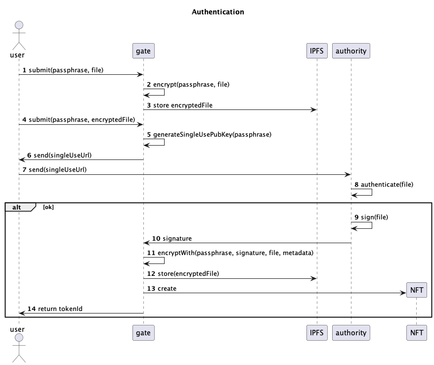
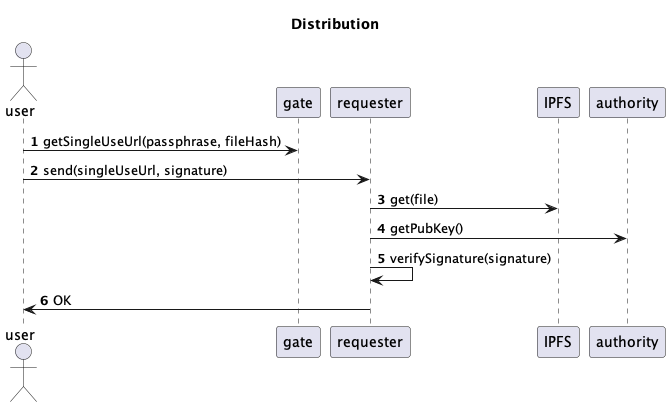

# EGÓ

## Ego eimi

ἐγώ εἰμι

(Ego eimi )

It is me!

EGÓ concept is to provide a safe

universal storage space for personal documents

anywhere

anytime

A few clicks away

[slides](https://docs.google.com/presentation/d/1lT9_KXww0aTn98ehBykI7jU2o1gxJ0p6O8S-bfM42Uo/edit?usp=sharing)

## Diagrams

## Advantages & Risk

### Advantages

* Hassle Free from carrying Documents.
* Loss of documents may not create any burden for any document verification.
* Can be shared anywhere where needed.
* Off Chain Encryption.(Protocol)

### Risks

* Long wait till Document get validated everywhere.
* If Private Key is lost recovery of Document can’t be done.

### Status
* Decrypting gate is missing
* We need a robust algorithm to generate single use keys
* We need a better UX

